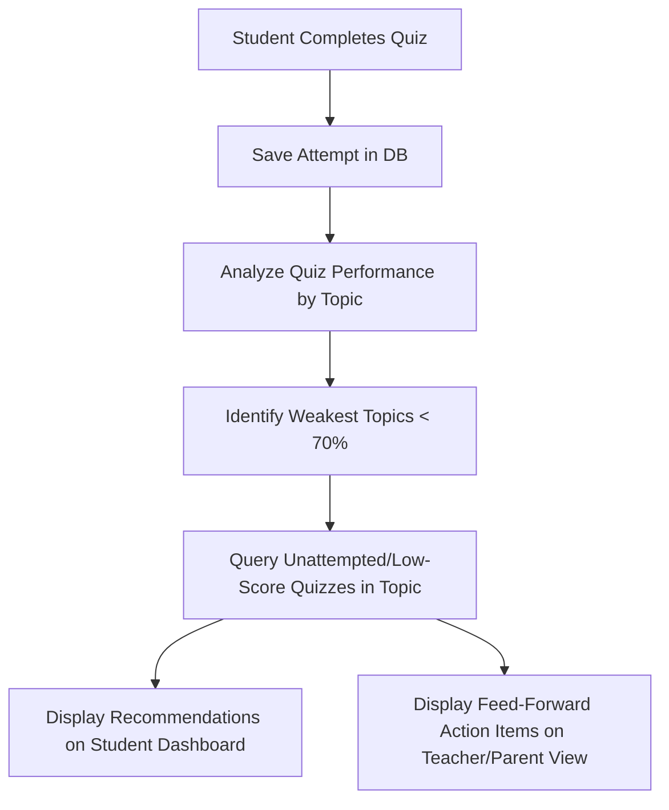

# EZRA LMS - Weakness Tracking & Feed-Forward System Implementation Plan

This document serves as the implementation specification and developer prompt for building the automated **Weakness Tracking and Feed-Forward (Quiz Recommendation)** system inside EZRA LMS.

---

## 1. Feature Specifications

### Objective
Provide automated, data-driven differentiated learning without manual teacher intervention by identifying a student's lowest-performing curriculum topics and instantly recommending relevant quizzes and materials.

### Core Workflow


---

## 2. Technical Design

### A. Database Relationships & Queries
We utilize the existing database tables (`quiz_attempts`, `quizzes`, `classwork_topics`, `classwork_subtopics`).

#### 1. Calculating Topic Mastery (SQL Example)
To determine a student's mastery level per topic, we calculate the average score of their latest attempt on each quiz:
```sql
WITH LatestAttempts AS (
    -- Get the most recent score for each quiz per user
    SELECT 
        userId, 
        quizId, 
        score, 
        maxScore,
        (CAST(score AS FLOAT) / maxScore) * 100 AS percentage,
        ROW_NUMBER() OVER (PARTITION BY userId, quizId ORDER BY completedAt DESC) as rn
    FROM quiz_attempts
    WHERE userId = :user_id
)
SELECT 
    t.topic_id,
    t.topic_name,
    AVG(la.percentage) as average_topic_score,
    COUNT(la.quizId) as quizzes_attempted
FROM LatestAttempts la
JOIN quizzes q ON la.quizId = q.quiz_id
JOIN classwork_topics t ON q.topic_id = t.topic_id
WHERE la.rn = 1
GROUP BY t.topic_id
HAVING average_topic_score < 70.0
ORDER BY average_topic_score ASC;
```

#### 2. Recommending Feed-Forward Items
Identify quizzes within the student's weak topics that they either haven't attempted or have previously failed:
```sql
SELECT q.quiz_id, q.quiz_title, q.topic_id, q.sub_topic_id
FROM quizzes q
WHERE q.topic_id = :weakest_topic_id
  AND q.is_published = 1
  AND q.quiz_id NOT IN (
      SELECT quizId 
      FROM quiz_attempts 
      WHERE userId = :user_id AND (CAST(score AS FLOAT) / maxScore) >= 0.7
  )
LIMIT 3;
```

---

## 3. Developer System Prompt
*Pass the prompt below to your AI assistant (e.g., Claude or Gemini) to generate the production-ready code inside your backend codebase.*

```text
You are an expert backend engineer working on the EZRA LMS platform.
Your task is to implement the "Weakness Tracking & Feed-Forward System" in the database repository.

### Requirements:
1. Create a Flask route `/api/student/<user_id>/weaknesses-and-recommendations` inside the Flask application.
2. The endpoint must:
   a. Query the `quiz_attempts` table to find all quiz attempts for the given `user_id`.
   b. Group attempts by the quiz's parent topic (joining with `quizzes` and `classwork_topics`).
   c. Calculate the mastery percentage for each topic based on the student's LATEST attempt for each quiz in that topic.
   d. Identify topics where the average score is under 70% (these are "Weakness Topics").
   e. Query the `quizzes` table to find published quizzes under those weak topics that the student has either:
      - Never attempted.
      - Attempted but scored under 70% on their latest run.
   f. Limit the recommendations to a maximum of 3 items.
3. Return a clean JSON payload structured as follows:
{
  "success": true,
  "student_id": "user_id_here",
  "weaknesses": [
    {
      "topic_id": "topic_123",
      "topic_name": "Algebraic Equations",
      "average_score": 58.3
    }
  ],
  "recommendations": [
    {
      "quiz_id": "quiz_456",
      "quiz_title": "Practice: Linear Variables",
      "topic_id": "topic_123",
      "sub_topic_id": "sub_789"
    }
  ]
}

### Guidelines:
- Ensure SQL queries are parameterized and safe from SQL injection.
- Add error handling and logging.
- Return appropriate HTTP status codes (e.g., 404 if user not found, 500 on db errors).
```

---

## 4. UI/UX Wireframe Guidelines

### Student Dashboard View
```text
+-------------------------------------------------------------+
| Welcome Back, [Student Name]!                               |
+-------------------------------------------------------------+
| [!] Personal Focus Areas (Auto-generated)                  |
| You are doing great, but let's review:                      |
| -> Geometry (Avg. 62%)                                      |
|                                                             |
| Recommended Practice:                                       |
| [ Start Quiz ] - Area & Perimeter Practice                  |
| [ Start Quiz ] - Triangles and Angles                       |
+-------------------------------------------------------------+
```

### Teacher View (Actionable Feedback Loop)
```text
+-------------------------------------------------------------+
| Differentiated Learning Insights                            |
+-------------------------------------------------------------+
| Student: [Student Name]                                     |
| Focus Needed: Algebra (55% average on last 3 quizzes)       |
|                                                             |
| Automated Action Taken:                                     |
| -> Sent "Practice: Linear Variables" to student feed        |
+-------------------------------------------------------------+
```
